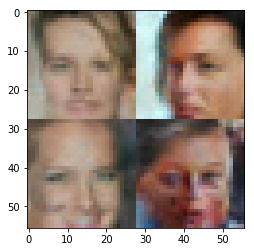

# Deep Learning Nanodegree Foundations - Project 5 - Generate faces.

I left the results from 2 networks, one with 2 convolutional layers for generator and discriminator, and another with 3. The result achieved is good with both, but the one with 3 layers seems clearly better. In both cases I stopped the training when I considered that the faces where good enough.

The notebooks can be run directly and will do the whole process, but an html version is stored with the result of the final code and hyperparameters selected.

A summary of the results is given below.

## Results with a 2 layers generator and discriminator

The first decent faces happened after 3 epochs:

Then during the learning many strange faces were appearing:

I let it run for 24 epochs and the best faces looked like this:

The result seems acceptable, but I still tried adding one more convolutional layer. 

## Results with a 3 layers generator and discriminator

There was a strange effect using 3 layers. The training starts good and faces can be recognized even before finishing the first epoch. However, the losses started to grow for the generator and the faces totally blurred away. Fortunately soon after that the training became effective and before the end of the 3rd epoch the faces looked as good as this:

Then during the training strange faces appeared:

But in 10 epochs the faces where very good, better than with 2 layers:

